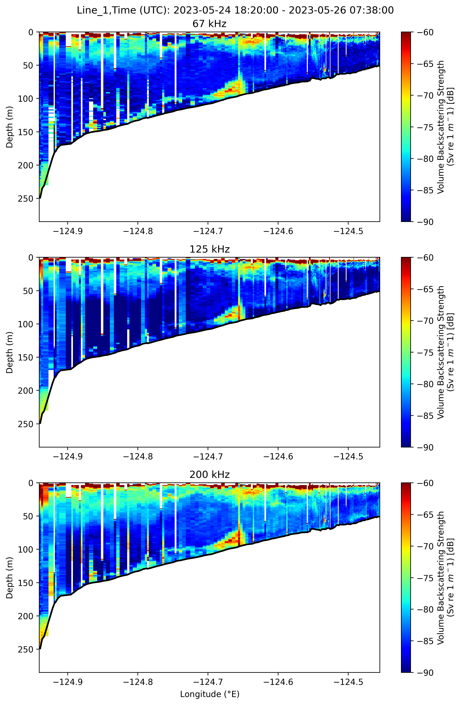
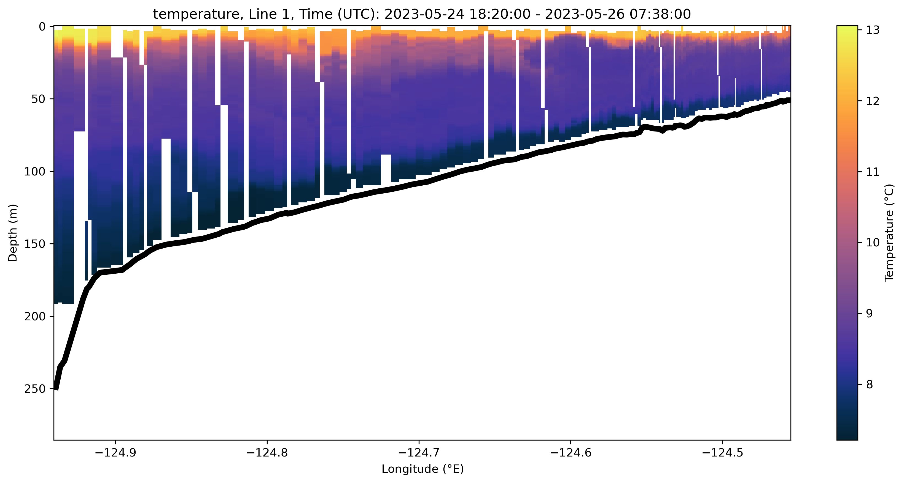
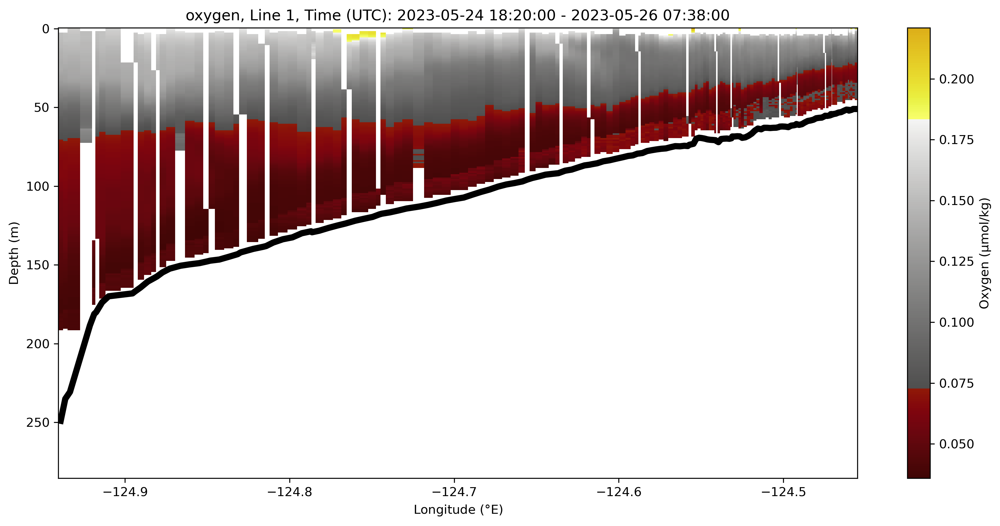

# Slocum-AZFP-Processing

## glider_process_individual.py
To run: `uv run glider_process_individual.py "path_to_PASS3_matfile" "to_process_path" "path_to_xml_file"`
- Uncomment lines 224-256 to create Sv figures for each file

Utilizes **convert_raw.py** and **convert_mat_to_netcdf.py** under `\utils`. 
- **convert_raw.py** converts raw AZFP echogram data to NetCDF using echopype.
- **convert_mat_to_netcdf.py** converts a .mat file to a NetCDF file.

## merge_glider_azfp.py
To run: `uv run merge_glider_azfp.py "path_to_processed_data" --transect-line None`
- Edit lines 17-44 for correct transect line dates
- Select which transect line you want to plot ex: `--transect-line 1`

